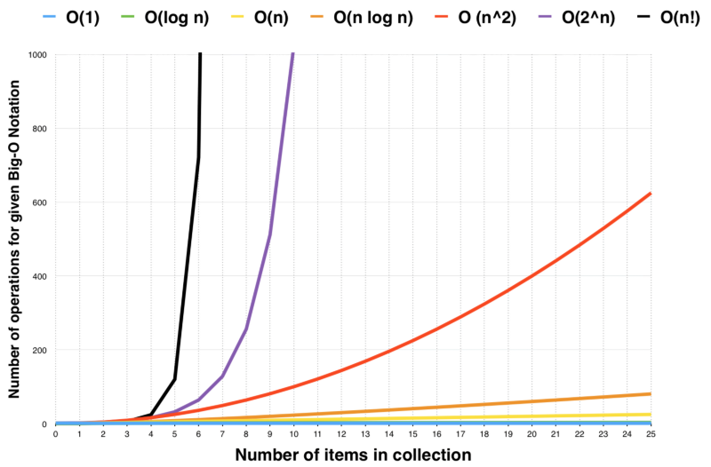

# Big O Notation
### A theoretical measure of the execution of an algorithm, usually the time or memory needed, given the problem size n, which is usually the number of items. 

### Here are some common types of time complexities in Big O Notation.

- O(1) - Constant time complexity
- O(n) - Linear time complexity
- O(log n) - Logarithmic time complexity
- O(n^2) - Quadratic time complexity

## In conclusion:
- Big-O notation gives you a way to calculate how long it will take to run your code. You can physically time how long your code takes to run, but with that method, it is hard to catch small time differences. For example, the time it takes between running 20 and 50 lines of code is very small. However, in a large program, those inefficiencies can add up.

-  Big-O notation counts how many steps an algorithm must execute to gauge its efficiency. Approaching your code in this manner can be very effective if you need to tune your code to increase efficiency. Big-O notation will enable you to measure different algorithms by the number of steps it requires to run and objectively compare the algorithms' efficiency.

