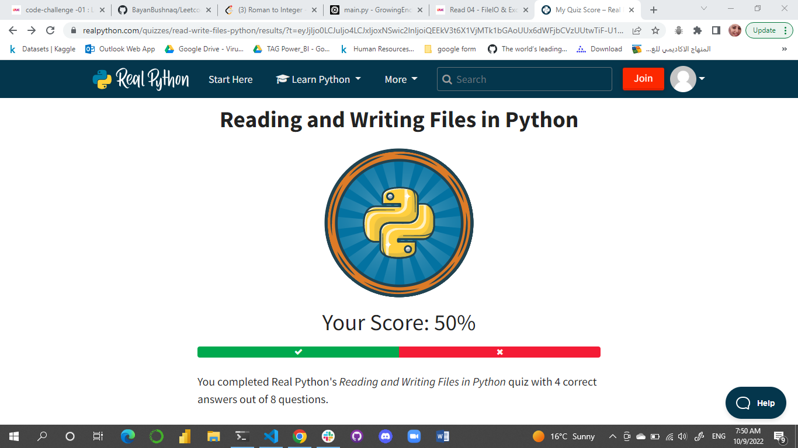

# Reading and Writing Files in Python
## What Is a File?
### a file is a contiguous set of bytes used to store data. This data is organized in a specific format and can be anything as simple as a text file or as complicated as a program executable. In the end, these byte files are then translated into binary 1 and 0 for easier processing by the computer.

## Files on most modern file systems are composed of three main parts:

- Header: metadata about the contents of the file (file name, size, type, and so on)
- Data: contents of the file as written by the creator or editor
- End of file (EOF): special character that indicates the end of the file

## How to get a file in python ?
### Using File Paths
### When you access a file on an operating system, a file path is required. The file path is a string that represents the location of a file. It’s broken up into three major parts:
- Folder Path
- File Name
- Extension

## Opening and Closing a File in Python
### file = open('fileName.extension')
### After you open a file, the next thing to learn is how to close it.
### there are 2 approaches to close the file in python :

- use the try-finally block:
- use the with statement

## What is mode in python file mean?
### what the process you want to do on python file, the default mode is -r reading mode.
### other character mode :

- 'w'	Open for writing, truncating (overwriting) the file first
- 'rb' or 'wb'	Open in binary mode (read/write using byte data)

## categories of file objects:
- Text files
- Buffered binary files
- Raw binary files

## Text File Types:
### A text file is the most common file that you’ll encounter

## Buffered Binary File Types
### A buffered binary file type is used for reading and writing binary files

## Raw File Types:
### generally used as a low-level building-block for binary and text streams, it is therefore not typically used.

## Iterating Over Each Line in the File:
-  A common thing to do while reading a file is to iterate over each line.
- Another way you could iterate over each line in the file is to use the Python .readlines() method of the file object.
(.readlines() returns a list where each element in the list represents a line in the file)

## Appending to a File:
###  you may want to append to a file or start writing at the end of an already populated file. This is easily done by using the 'a' character for the mode argument

## Some libraries to work with common file types:
- wave: read and write WAV files (audio)
- aifc: read and write AIFF and AIFC files (audio)
- sunau: read and write Sun AU files
- tarfile: read and write tar archive files
- zipfile: work with ZIP archives
- configparser: easily create and parse configuration files
- xml.etree.ElementTree: create or read XML based files
- msilib: read and write Microsoft Installer files
- plistlib: generate and parse Mac OS X .plist files

# Python Exceptions
## An exception is an event, which occurs during the execution of a program that disrupts the normal flow of the program's instructions. In general, when a Python script encounters a situation that it cannot cope with, it raises an exception. An exception is a Python object that represents an error.

### Syntax errors occur when the parser detects an incorrect statement.

###  exception error. This type of error occurs whenever syntactically correct Python code results in an error. 

## Raising an Exception
### We can use raise to throw an exception if a condition occurs. The statement can be complemented with a custom exception.

## The AssertionError Exception
### Instead of waiting for a program to crash midway, you can also start by making an assertion in Python. We assert that a certain condition is met. If this condition turns out to be True, then that is excellent! The program can continue. If the condition turns out to be False, you can have the program throw an AssertionError exception.

## The try and except Block: Handling Exceptions
### The try and except block in Python is used to catch and handle exceptions. Python executes code following the try statement as a “normal” part of the program. The code that follows the except statement is the program’s response to any exceptions in the preceding try clause.

## Here is some tips to use try - exception phrase : 
- A try clause is executed up until the point where the first exception is encountered.
- Inside the except clause, or the exception handler, you determine how the program responds to the exception.
- You can anticipate multiple exceptions and differentiate how the program should respond to them.

## The else Clause
### In Python, using the else statement, you can instruct a program to execute a certain block of code only in the absence of exceptions

## Cleaning Up After Using finally
### The finally block will be executed no matter if the try block raises an error or not. This can be useful to close objects and clean up resources

## Conclusion:
- raise allows you to throw an exception at any time.
- assert enables you to verify if a certain condition is met and throw an exception if it isn’t.
- In the try clause, all statements are executed until an exception is encountered.
- except is used to catch and handle the exception(s) that are encountered in the try clause.
- else lets you code sections that should run only when no exceptions are encountered in the try clause.
- finally enables you to execute sections of code that should always run, with or without any previously encountered exceptions.

